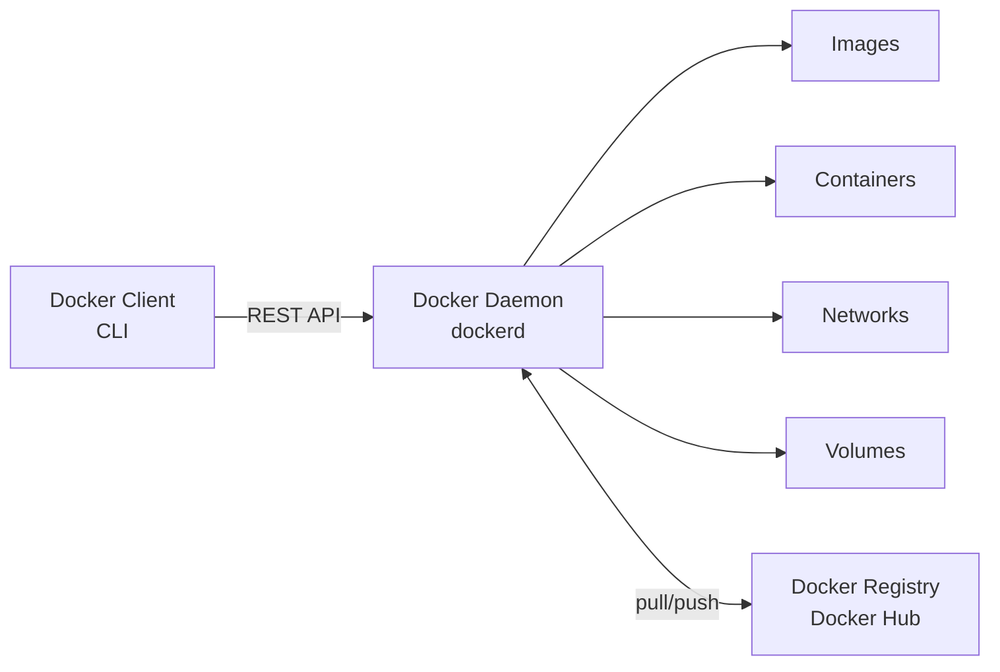

# 🐳 Docker

## 📌 What is Docker?

Docker is an open-source containerization platform that allows developers to package applications along with all their dependencies (libraries, configs, runtime) into a single lightweight, portable unit called a **container**. Unlike virtual machines, containers share the host OS kernel, making them faster to start and much more resource-efficient. This ensures the application runs consistently across different environments — "it works on my machine" problems are eliminated.

---

## 🏗️ Docker Architecture

Docker follows a **client-server architecture**:



### Components

- **Docker Client** – The CLI/tool used to interact with Docker (`docker build`, `docker run`, etc.)
- **Docker Daemon (dockerd)** – Background service that manages images, containers, networks, and volumes.
- **Docker Registry** – Stores Docker images (e.g., Docker Hub); used to pull and push images.
- **Docker Objects** – Images, Containers, Networks, and Volumes.

---

## 🧩 Core Concepts

| Concept | Description |
|---------|-------------|
| **Dockerfile** | A text file containing step-by-step instructions to build a Docker image (base image, dependencies, commands, ports, etc.). |
| **Docker Image** | A read-only template (blueprint) used to create containers. Built from a Dockerfile. |
| **Docker Container** | A running (or stopped) instance of an image—the isolated environment where the application executes. |
| **Docker Hub** | A cloud-based registry where Docker images are stored and shared publicly or privately. |

---

## ⚙️ Docker Networking

Docker provides several network drivers:

| Network Type | Description |
|--------------|-------------|
| **Bridge (default)** | Containers on the same host communicate using an isolated private network. |
| **Host** | Container shares the host's network stack directly (no network isolation). |
| **None** | Container has no network connectivity. |
| **Overlay** | Used for communication across multiple Docker hosts (typically Docker Swarm). |

### Useful Commands

```bash
docker network ls
docker network create my_network
docker network inspect my_network
```

---

## 💾 Docker Volumes vs Bind Mounts

| Docker Volumes | Bind Mounts |
|---------------|-------------|
| Managed entirely by Docker. Stored under `/var/lib/docker/volumes`. | Maps a specific host directory or file into the container. |
| Easier to back up, migrate, and share between containers. | Directly tied to the host filesystem. |
| Recommended for persistent production data. | Useful during development (live code reload, editing files). |

### Commands

```bash
docker volume create my_volume

# Using a Docker volume
docker run -v my_volume:/app/data myapp

# Using a bind mount
docker run -v /host/path:/container/path myapp
```

---

## 🚀 Image Optimization Techniques

- **Use multi-stage builds** to separate build and runtime environments.
- **Use slim or Alpine base images** (e.g., `python:3.11-slim`).
- **Create a `.dockerignore` file** to exclude unnecessary files such as `.git`, `node_modules`, and logs.
- **Reduce image layers** by combining commands with `&&`.
- **Leverage Docker cache** by placing infrequently changing instructions before frequently changing ones.

### Example: Multi-stage Build

```dockerfile
FROM node:18 AS build

WORKDIR /app

COPY . .

RUN npm install && npm run build

FROM nginx:alpine

COPY --from=build /app/dist /usr/share/nginx/html
```

---

## 💻 Common Docker Commands

### Images

```bash
docker build -t myapp .
docker images
docker pull nginx
docker push username/myapp
docker rmi <image_id>
```

### Containers

```bash
docker run -d -p 8080:80 --name mycontainer myapp
docker ps
docker ps -a
docker stop <container_id>
docker start <container_id>
docker restart <container_id>
docker rm <container_id>
```

### Logs & Debugging

```bash
docker logs <container_id>
docker exec -it <container_id> bash
docker inspect <container_id>
```

### Volumes

```bash
docker volume ls
docker volume create my_volume
docker volume inspect my_volume
docker volume rm my_volume
```

### Networks

```bash
docker network ls
docker network create my_network
docker network inspect my_network
docker network rm my_network
```

### Cleanup

```bash
docker system prune
docker system prune -a
docker image prune
docker volume prune
```

---

# ❓ Questions & Answers

### Q1. CMD vs ENTRYPOINT — What's the difference?

**Answer:**

- `CMD` provides the default command or arguments for a container.
- It **can be overridden** when running the container.
- `ENTRYPOINT` specifies the executable that always runs.
- Arguments passed during `docker run` are appended to the `ENTRYPOINT`.

Example:

```dockerfile
ENTRYPOINT ["python"]
CMD ["app.py"]
```

```bash
docker run myapp
```

Runs:

```bash
python app.py
```

```bash
docker run myapp test.py
```

Runs:

```bash
python test.py
```

---

### Q2. docker run vs docker start

**docker run**

- Creates a **new container** from an image.
- Starts the container.
- Used the first time.

Example:

```bash
docker run nginx
```

**docker start**

- Starts an **existing stopped container**.
- Does **not** create a new container.

Example:

```bash
docker start mycontainer
```

---

### Q3. docker start vs docker exec

**docker start**

- Starts a stopped container.
- Runs the container's main process.

**docker exec**

- Executes an additional command inside an already running container.
- Commonly used for debugging.

Example:

```bash
docker exec -it mycontainer bash
```

---

### Q4. Image vs Container

| Docker Image | Docker Container |
|--------------|------------------|
| Blueprint/template | Running instance of an image |
| Read-only | Read-write |
| Cannot execute by itself | Executes the application |
| Can create multiple containers | Created from an image |

---

### Q5. What is the difference between a Volume and a Bind Mount?

**Volume**

- Managed by Docker.
- Best for persistent application data.
- Easier to migrate and back up.

**Bind Mount**

- Uses a host directory.
- Good for development.
- Changes on the host are immediately visible inside the container.

---

### Q6. Why do we use Docker?

- Consistent environments across development, testing, and production.
- Lightweight compared to virtual machines.
- Fast startup.
- Easy deployment.
- Better resource utilization.
- Simplifies dependency management.

---

### Q7. Why are containers lighter than virtual machines?

Containers share the host operating system kernel instead of running a complete guest operating system. As a result, they require less memory, consume fewer resources, and start much faster than virtual machines.

---

## 📚 Resources

- GeeksforGeeks Docker Tutorial
