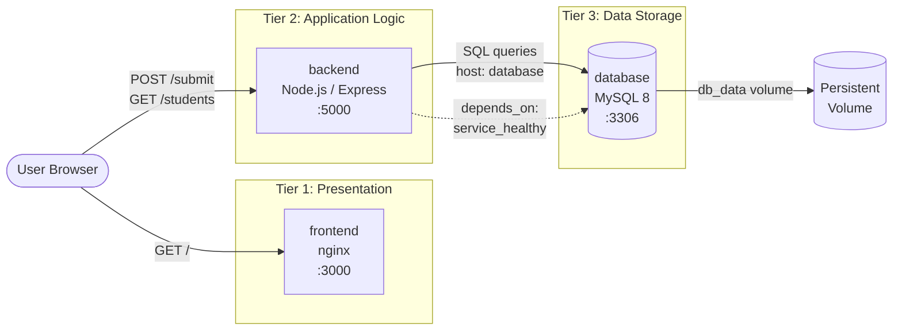

# 🎓 Student Registration App — 3-Tier Docker Compose Demo

## 🎯 Objective
Build a minimal 3-tier web application demonstrating containerized multi-service architecture using Docker Compose. Users submit student names and roll numbers through a web form; data is persisted in MySQL and displayed back in a live table.

This project demonstrates:
- Clean separation of concerns across **presentation**, **application logic**, and **data** layers
- How independent containers (nginx, Node.js, MySQL) communicate over an internal Docker network using **service names** instead of IP addresses
- How Docker Compose orchestrates multi-container startup order, networking, and persistent storage with a single command

## 🧱 Prerequisites
- Docker
- Docker Compose (bundled with Docker Desktop, or `docker-compose` / `docker compose` CLI on Linux)

## 🏗️ Architecture



| Tier | Technology | Role |
|---|---|---|
| **Frontend** | Static HTML/JS served by nginx | Registration form + live student table, calls the backend API directly from the browser |
| **Backend** | Node.js + Express (`mysql2`, `cors`) | REST API: `POST /submit`, `GET /students`; owns all SQL logic |
| **Database** | MySQL 8 | Persists student records in a `students` table inside the `studentdb` schema |

## 📁 Project Structure

```
docker-compose-demo/
├── docker-compose.yml       # orchestrates all 3 services
├── frontend/
│   ├── Dockerfile           # nginx:alpine serving static file
│   └── index.html           # form + table + fetch() calls to backend
├── backend/
│   ├── Dockerfile           # node:20-alpine running Express
│   ├── package.json         # express, mysql2, cors
│   └── server.js            # REST API + MySQL connection/retry logic
```

## ⚙️ How It Works

1. **`docker-compose up`** builds and starts all three containers on a shared Docker network, where each service reaches the others by name (`database`, `backend`, `frontend`) instead of hardcoded IPs.

2. **Startup ordering:** the `backend` service uses `depends_on: database: condition: service_healthy`, so Compose won't start the backend until MySQL's healthcheck (`mysqladmin ping`) passes. The backend also retries its own DB connection every 3 seconds (`connectWithRetry()` in `server.js`) as a second layer of protection — because "container is running" and "MySQL is actually ready to accept connections" aren't the same moment.

3. **First successful connection:** the backend automatically runs `CREATE TABLE IF NOT EXISTS students (...)`, so the schema is provisioned with zero manual setup.

4. **User flow:**
   - Browser loads `http://localhost:3000` → nginx serves the static form
   - User submits a name + roll number → browser calls `http://localhost:5000/submit` directly (CORS-enabled) → Express inserts a row into MySQL
   - Page then calls `http://localhost:5000/students` → Express queries MySQL → table re-renders with all registered students

5. **Persistence:** the `db_data` named volume maps to MySQL's data directory, so student records survive container restarts (only lost if the volume is explicitly removed).

## 🤔 Why Docker Compose (Instead of Running Each Container Manually)

| Benefit | Description |
|---|---|
| **One command, one file** | `docker-compose up` builds all 3 images and starts them together, instead of manually running `docker build` / `docker run` three times with matching network flags |
| **Built-in networking** | Compose creates a private network automatically; containers resolve each other by **service name** (backend connects to `host: 'database'`, not a manually looked-up IP) |
| **Startup dependencies** | `depends_on` + `condition: service_healthy` declaratively expresses "don't start X until Y is actually ready" — no custom wait-scripts needed |
| **Reproducibility** | Anyone who clones this repo gets an identical environment with one command — no "works on my machine" drift between Node/MySQL versions |
| **Easy teardown/reset** | `docker-compose down -v` cleanly removes everything, including the database volume, for a fresh start |

## 🪜 Running It

```bash
docker-compose up --build
```

Then open:
```
http://localhost:3000
```

Register a student — the table below the form updates immediately by re-querying the backend.

**To stop:**
```bash
docker-compose down
```

**To stop and wipe the database (fresh start):**
```bash
docker-compose down -v
```

## ✅ Verifying Each Tier Independently

**Frontend is serving:**
```bash
curl -I http://localhost:3000
```

**Backend API directly (bypassing the UI):**
```bash
curl http://localhost:5000/students

curl -X POST http://localhost:5000/submit \
  -H "Content-Type: application/json" \
  -d '{"name":"Ali Raza","roll_no":"CS-101"}'
```

**Database directly (confirms data actually persisted, not just returned by the API):**
```bash
docker exec -it $(docker ps -qf "name=database") \
  mysql -uroot -pexamplepass studentdb -e "SELECT * FROM students;"
```

**Check container health / startup order:**
```bash
docker-compose ps
docker-compose logs backend
```
You should see `DB not ready yet, retrying in 3s...` a few times before `Connected to MySQL database!` — a live example of the retry logic handling the gap between "container started" and "MySQL ready".

## 📸 Screenshots
*(Add: registration form, live student table, docker-compose ps output)*

## ⚠️ Known Limitations
- DB credentials are hardcoded in `docker-compose.yml` and `server.js` — fine for a local demo, but in production these belong in environment variables or Docker secrets, not source code
- The frontend calls `http://localhost:5000` directly from the browser, which only works because both containers publish ports to `localhost` on the host machine. In a real deployment behind a single domain, `/api` would typically route through the same origin (e.g., an nginx reverse proxy) instead of exposing the backend port publicly
- No input validation on the `/submit` endpoint — any string is accepted as `name`/`roll_no`

## 🧠 Key Learnings
- How Docker Compose enables service-name-based networking instead of manual IP management
- Difference between a container being "up" vs. the application inside being "ready" — and why retry logic matters
- How `depends_on` with health conditions creates reliable multi-container startup ordering
- Trade-offs of local dev convenience (hardcoded creds, direct port exposure) vs. production-readiness