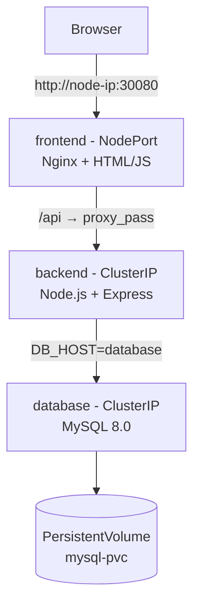
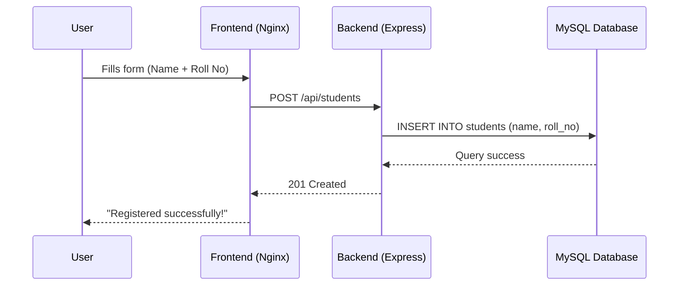
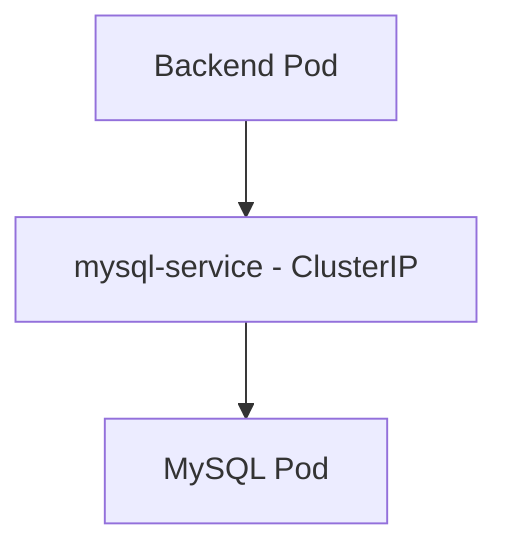

# 🎓 Student Registration App — Docker Compose to Kubernetes

A 3-tier web application (Frontend → Backend → MySQL) deployed first with Docker Compose, then migrated to Kubernetes to explore how container orchestration handles scheduling, networking, configuration, and storage at a deeper level than Compose does automatically.

## 📌 Goal Statement

Deploy the same 3-tier Student Registration app onto a Kubernetes cluster, inside a dedicated Namespace, using proper Kubernetes objects — and use that process to observe:

- How Pods get created, scheduled, and run containers
- How Kubernetes networking works (Services, ClusterIP, DNS-based service discovery — the K8s equivalent of Compose's service-name resolution)
- How this compares structurally to what Docker Compose did automatically

## ✅ What Was Achieved

- Deployed a complete 3-tier application on Kubernetes
- Organized all resources inside a dedicated Namespace
- Packaged the frontend and backend into Docker images
- Deployed MySQL using a Kubernetes Deployment
- Exposed MySQL using an internal ClusterIP Service
- Stored database credentials securely using Secrets
- Stored non-sensitive configuration using ConfigMaps
- Persisted database data using a PersistentVolumeClaim (PVC)
- Deployed the backend and connected it to MySQL using Kubernetes DNS
- Deployed the frontend and exposed it externally using a NodePort Service
- Explored Kubernetes networking and service discovery
- Compared Kubernetes architecture with Docker Compose

## 🏗️ Architecture



All three tiers run as Pods inside the `student-app` Namespace, each fronted by its own Service.

## ⚙️ Kubernetes Resources Used

| Resource | Role in this project |
|---|---|
| **Namespace** | `student-app` — isolates everything from `default` / `kube-system` |
| **Deployment** | Declares desired Pod state for MySQL, backend, and frontend; handles restarts and replicas |
| **Service (ClusterIP)** | Gives `database` and `backend` stable internal DNS names for Pod-to-Pod traffic |
| **Service (NodePort)** | Exposes `frontend` on port `30080` for browser access |
| **Secret** | Stores `MYSQL_ROOT_PASSWORD` / `MYSQL_PASSWORD` |
| **ConfigMap** | Stores non-sensitive values: `DB_HOST`, `DB_NAME`, `DB_USER`, `DB_PORT` |
| **PersistentVolumeClaim** | Requests durable storage so MySQL data survives Pod restarts |

## 🔄 Request Flow



## 🌐 Networking Deep Dive

One of the main learning objectives of this project was understanding Kubernetes networking.

The backend does **not** communicate directly with the MySQL Pod. Instead, it communicates with a Kubernetes **Service**:



The backend is configured with:
```
DB_HOST=mysql-service
```

When the backend connects to `mysql-service`:

1. Kubernetes DNS resolves the name `mysql-service`
2. The request reaches the Service's ClusterIP
3. The Service forwards traffic to the running MySQL Pod
4. The database processes the SQL query and returns the response

This ensures that even if the MySQL Pod is recreated and receives a different IP address, the backend continues to communicate using the same Service name — no code or config changes needed.

##  Outcome

All three tiers run as independent Pods communicating exclusively through Kubernetes Services. The frontend is reachable from a browser via NodePort, the backend resolves the database purely by DNS name, and MySQL data persists across Pod restarts via a PersistentVolumeClaim.

Submitting a student's Name and Roll No through the UI flows end-to-end through all three tiers and lands correctly in the database — the same outcome as the Compose version, achieved through explicit, inspectable Kubernetes objects instead of implicit tooling defaults.
