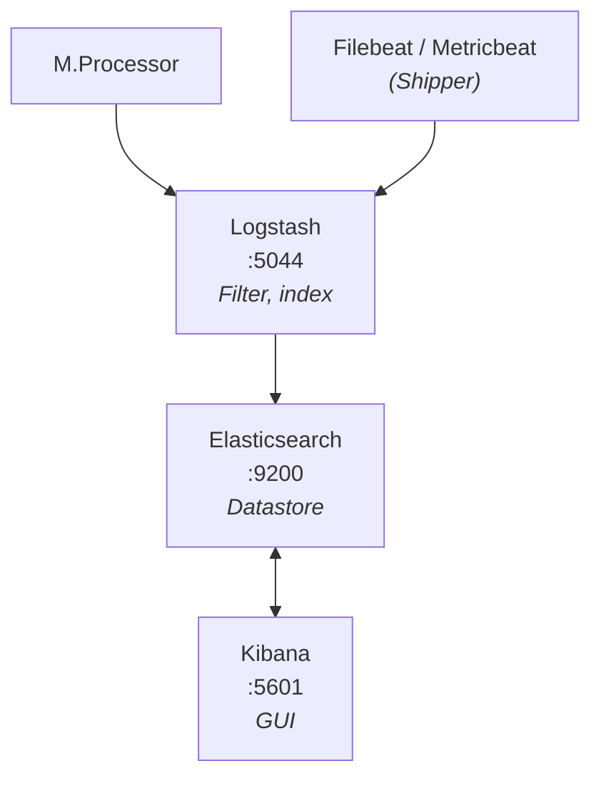

# ELK Stack + Real-Time Error Alerting — Elasticsearch, Kibana, Filebeat, Dockerized Auth API

A self-hosted log monitoring and alerting pipeline built on the Elastic Stack
(Elasticsearch, Kibana, Filebeat) running as native systemd services on a
single Ubuntu VM, extended with a Dockerized demo application that generates
real HTTP errors and a dedicated alerting index/dashboard for them.

---

## Table of contents
- [Part 1 — Base ELK stack setup](#part-1--base-elk-stack-setup)
- [Part 2 — Real error alerting pipeline](#part-2--real-error-alerting-pipeline)
- [Architecture](#architecture)
- [Key file locations](#key-file-locations)

---

## Part 1 — Base ELK stack setup

**Goal:** get Elasticsearch, Kibana, and Filebeat running as systemd services
on one VM, understanding each layer (config files, REST APIs, service
lifecycle) rather than hiding it behind containers.

### 1. Installed via APT
```bash
wget -qO - https://artifacts.elastic.co/GPG-KEY-elasticsearch | sudo gpg --dearmor -o /usr/share/keyrings/elastic-keyring.gpg
echo "deb [signed-by=/usr/share/keyrings/elastic-keyring.gpg] https://artifacts.elastic.co/packages/8.x/apt stable main" | sudo tee /etc/apt/sources.list.d/elastic-8.x.list
sudo apt-get update
sudo apt-get install elasticsearch kibana filebeat
```

### 2. Enabled and started as systemd services
```bash
sudo systemctl daemon-reload
sudo systemctl enable --now elasticsearch
sudo systemctl enable --now kibana
sudo systemctl enable --now filebeat
```

### 3. Enrolled Kibana with Elasticsearch
```bash
sudo /usr/share/elasticsearch/bin/elasticsearch-create-enrollment-token -s kibana
```
Token pasted into Kibana's browser setup screen to establish trust between
the two services.

### 4. Configured the original Filebeat
`/etc/filebeat/filebeat.yml`:
```yaml
filebeat.inputs:
  - type: filestream
    id: my-filestream-id
    enabled: true
    paths:
      - /var/log/*.log
      - /var/log/syslog

output.elasticsearch:
  hosts: ["https://localhost:9200"]
  username: "elastic"
  password: "<redacted>"
  ssl.verification_mode: none
```

### 5. Verified end-to-end
```bash
sudo filebeat test config
sudo filebeat test output
sudo filebeat setup -e          # loads index template + Kibana dashboards
for i in {1..20}; do logger "filebeat test line $i - $(date)"; done
curl -k -u "elastic:<password>" "https://localhost:9200/filebeat-*/_count?pretty"
```
Confirmed a non-zero doc count, then viewed entries live in **Kibana →
Discover** under the `filebeat-*` data view.


---

## Part 2 — Real error alerting pipeline

**Goal:** extend the base stack with a demo service that produces *real*
HTTP errors (not simulated/random), ship those into their own index, build a
dashboard around them, and alert by email when errors spike or the service
goes silent.

### Why a second Filebeat instance
Filebeat has one global `output.elasticsearch` block. Rather than risk
breaking the original pipeline's index template / ILM settings, a second,
independent Filebeat instance was run — its own config, data dir, and
systemd unit — dedicated solely to this new log source.

### 1. Login API (the thing generating real errors)
A small Flask app, containerized, exposing:

| Route | Behavior |
|---|---|
| `GET /` | Browser-friendly login test page (form + buttons) |
| `POST /login` | `{"username","password"}` → 200 + token on success, 401 logged on wrong creds |
| `GET /orders` | Needs `Authorization: Bearer <token>` → 401 if missing, 403 if invalid, 200 if valid |
| any other path | 404, logged |

Every response — success **and** failure — writes one line to
`/var/log/app/error.log` inside the container in this format:
```
2026-07-21T07:59:26.262767Z ERROR 401 /login - Unauthorized - invalid username or password (client=172.17.0.1)
2026-07-21T08:04:02.118432Z INFO 200 /login - Login successful (client=172.17.0.1)
```
Nothing here is randomly generated — every line is a genuine response to a
genuine request.


Credentials defined in `app.py` (demo only):
```python
USERS = {
    "admin": "S3cure!Pass",
    "alice": "alicepw123",
}
```

**Run it, bind-mounting the log dir out to the host:**
```bash
sudo mkdir -p /var/log/app-alerts
sudo docker build -t login-api ./login-api
sudo docker run -d --name login-api \
  -p 8080:5000 \
  -v /var/log/app-alerts:/var/log/app \
  login-api
```

### 2. Second Filebeat instance — ships to a dedicated `alerts-*` index

Dirs:
```bash
sudo mkdir -p /etc/filebeat-alerts /var/lib/filebeat-alerts /var/log/filebeat-alerts
```

`/etc/filebeat-alerts/filebeat.yml`:
File Attached for reference

### 4. Kibana dashboard
- **Stack Management → Data Views** → create `alerts-*`, timestamp `@timestamp`
- **Discover** → verify error/success lines stream in live
- **Visualize Library → Lens** → Pie chart, `status_code` as Terms
  aggregation (or "Split chart" by `status_code` for one pie per code) →
  save


### 5. Email alerting (Kibana Alerting → `.es-query` rules)
Two rules, both actioned through an Email connector:
1. **Error spike** — fires when `alerts-*` gets more than N docs matching
   `status_code >= 400` in a 5-minute window
2. **Service down** — fires when **zero** docs land in `alerts-*` for 5
   minutes, implying the app/Filebeat stopped shipping


---

## Architecture

```
                     ┌────────────────────────┐
                     │   login-api (Docker)   │
                     │  Flask auth service    │
                     └───────────┬────────────┘
                                 │ writes
                                 ▼
                  /var/log/app-alerts/error.log   (host, bind mount)
                                 │
                                 ▼
                 ┌──────────────────────────────┐
                 │  filebeat-alerts (systemd)   │
                 │  dissect + drop_fields       │
                 └───────────────┬──────────────┘
                                 │ HTTPS, Bulk API
                                 ▼
                    ┌────────────────────────┐
                    │     Elasticsearch      │  https://localhost:9200
                    │  index: alerts-*       │
                    └───────────┬────────────┘
                                 │ Search API / Alerting
                                 ▼
                    ┌────────────────────────┐
                    │        Kibana          │  http://localhost:5601
                    │  Discover + Dashboard   │
                    │  Alerting → Email       │
                    └────────────────────────┘

(unchanged, running in parallel)
Various host logs ──▶ filebeat (systemd) ──▶ Elasticsearch (filebeat-*)
```

---

## Key file locations

| Component | Config | Data | Logs |
|---|---|---|---|
| Elasticsearch | `/etc/elasticsearch/elasticsearch.yml` | `/var/lib/elasticsearch/` | `/var/log/elasticsearch/` |
| Kibana | `/etc/kibana/kibana.yml` | `/var/lib/kibana/` | `/var/log/kibana/` |
| Filebeat (original) | `/etc/filebeat/filebeat.yml` | `/var/lib/filebeat/registry/` | `/var/log/filebeat/` |
| Filebeat (alerts) | `/etc/filebeat-alerts/filebeat.yml` | `/var/lib/filebeat-alerts/` | `/var/log/filebeat-alerts/` |
| login-api | `login-api/app.py`, `Dockerfile` | n/a (stateless) | `/var/log/app-alerts/error.log` (host) |

---
