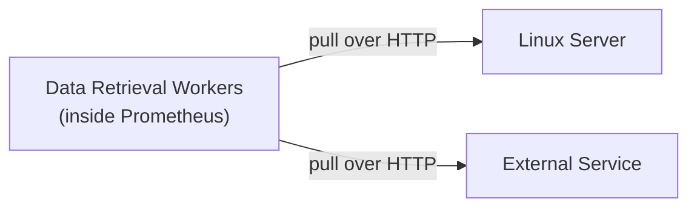
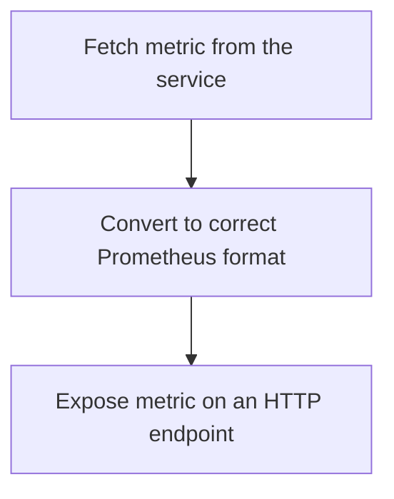
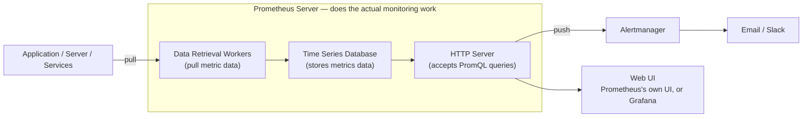

# Prometheus & Grafana — Core Concepts

A reference guide covering the fundamentals of Prometheus and Grafana: what problem they solve, how metrics are collected, the different metric types, Prometheus's internal architecture, and the key configuration concepts behind `prometheus.yml`.

---

## 1. What Prometheus Is Built For

Prometheus was built to monitor **highly dynamic container environments** — systems where things scale up, scale down, and move around constantly.

It works equally well with:
- **Docker / Kubernetes** — dynamic, ephemeral workloads
- **Traditional bare servers** — static, long-running infrastructure

### Why this matters
In modern systems, you often have **multiple servers running containerized applications**, distributed across different locations — hundreds of interconnected processes. At that scale, you need automated, continuous answers to:

- Is anything **erroring**?
- Is anything **overloaded**?
- What's the **response latency**?
- Do services have **enough resources** (CPU, memory, disk)?

Prometheus answers these questions by continuously tracking what's happening at the **hardware and software level** across your entire system.

---

## 2. What Prometheus Monitors — "Targets" and "Metrics"

A **target** is anything Prometheus watches — a server, an application, a service, a database.

Examples of targets:
- **Applications** — exception count, HTTP request count, request duration, HTTP error rate
- **Servers** — Linux/Windows, Apache server status, CPU usage, memory usage
- **Services** — databases and other backend services

> **A metric = a unit being monitored on a target.**
> e.g. CPU usage, number of exceptions, request duration — each of these is one metric.

---

## 3. Metric Types

Every metric Prometheus collects falls into one of these core types:

| Type | What it tracks | Example |
|---|---|---|
| **Counter** | How many times something happened. Only ever goes **up** (or resets to 0 on restart) | `login_attempts_total`, total HTTP requests |
| **Gauge** | A current value that can go **up or down** | CPU usage %, disk space used, active sessions |
| **Histogram** | How long something took / distribution of values | Request duration, latency buckets |

Each metric also carries:
- **Type** — counter, gauge, or histogram
- **HELP attribute** — a human-readable description of what the metric actually represents

```
# HELP node_cpu_seconds_total Seconds the CPUs spent in each mode.
# TYPE node_cpu_seconds_total counter
```

---

## 4. Collecting Metric Data from a Target — The Pull Model

Prometheus uses a **pull-based** model: it reaches out to targets and retrieves data, rather than waiting for targets to send data to it.



For this to work, two conditions must be met on the target side:

1. **The metric must be revealed** — exposed on an HTTP endpoint (host address + `/metrics` path)
2. **Data must be in the correct format** — Prometheus's plain-text exposition format

If a service **doesn't** natively expose metrics in this format, you use an **Exporter** — a small adapter process that sits next to (or inside) the service and:



`node_exporter` is the most common example — it reads Linux kernel stats (`/proc`, `/sys`) and re-exposes them in Prometheus format on port `9100`.

### The Push Model (exception, not the default)
Some cases don't fit the pull model well — e.g. **short-lived jobs** that finish before Prometheus would ever get a chance to scrape them, or services like **Amazon CloudWatch** and microservices that push data out on their own (to avoid traffic overload from being scraped directly).

For these, Prometheus uses a **Pushgateway** — an intermediary that accepts pushed metrics and holds them until Prometheus scrapes the Pushgateway itself. This keeps the core pull model intact even for jobs that can't be pulled from directly.

> Note: in a typical setup, data can be pulled by **multiple Prometheus instances** from the same targets if needed — nothing about the pull model restricts you to a single Prometheus server.

---

## 5. Prometheus Architecture



### The three internal components of the Prometheus server:

1. **Data Retrieval Workers** — pull metric data from targets (applications, servers, services)
2. **Time Series Database (TSDB)** — stores all the scraped metrics data over time
3. **HTTP Server** — accepts PromQL queries from users or from a UI (Prometheus's built-in Web UI or Grafana)

### What happens on an alert
When an alerting rule's condition is met, Prometheus **pushes** that alert to **Alertmanager**, which is responsible for routing it out to Email, Slack, or other notification channels. Prometheus itself never sends notifications directly.

### Storage location
By default, Prometheus's time-series data is stored at:
```
/var/lib/prometheus
```

---

## 6. `prometheus.yml` — The Core Configuration File

Located at:
```
/etc/prometheus/prometheus.yml
```

This file answers one core question: **which targets should Prometheus scrape, and how often?**

### Key sections:

**`scrape_configs`** — defines *what* Prometheus monitors
```yaml
scrape_configs:
  - job_name: 'prometheus'
    static_configs:
      - targets: ['localhost:9090']
```
- **`job_name`** — a label identifying the group of targets (e.g. `job_name: prometheus` monitors the metrics exposed by the Prometheus server itself)
- **`targets`** — the actual host:port addresses to scrape
- Scrape interval — how frequently Prometheus pulls from each target

**`rule_files`** — used for **rules**: aggregating data and creating alerts based on conditions
```yaml
rule_files:
  - "alert_rules.yml"
```

---

## 7. Default Ports

| Service | Default Port |
|---|---|
| Prometheus | `9090` |
| Node Exporter | `9100` |

---

## 8. Where Grafana Fits In

Grafana is **not** part of Prometheus's internal architecture — it's an external consumer of Prometheus's HTTP Server, exactly like Prometheus's own built-in Web UI is.

```
Prometheus HTTP Server → queried by → Prometheus's own Web UI  (built-in, basic)
                        → queried by → Grafana                  (external, rich dashboards & alerting)
```

Grafana connects to Prometheus as a **data source**, runs PromQL queries against it, and turns the results into dashboards, panels, and its own alerting layer — without ever touching Prometheus's storage or scraping logic directly.

---

## 9. Quick Glossary

| Term | Meaning |
|---|---|
| **Target** | Anything Prometheus monitors (server, app, service) |
| **Metric** | A specific unit being tracked on a target (CPU usage, request count, etc.) |
| **Exporter** | A helper process that exposes a service's metrics in Prometheus format when the service doesn't do so natively |
| **Scrape** | The act of Prometheus pulling metric data from a target over HTTP |
| **Job** | A named group of targets in `prometheus.yml` |
| **Rule** | A definition used to aggregate metrics or trigger alerts |
| **Alertmanager** | The component responsible for routing firing alerts to notification channels (email, Slack, etc.) |
| **TSDB** | Time Series Database — where Prometheus stores all scraped data |
| **Pushgateway** | Intermediary used for short-lived jobs or services that push rather than get pulled from |
