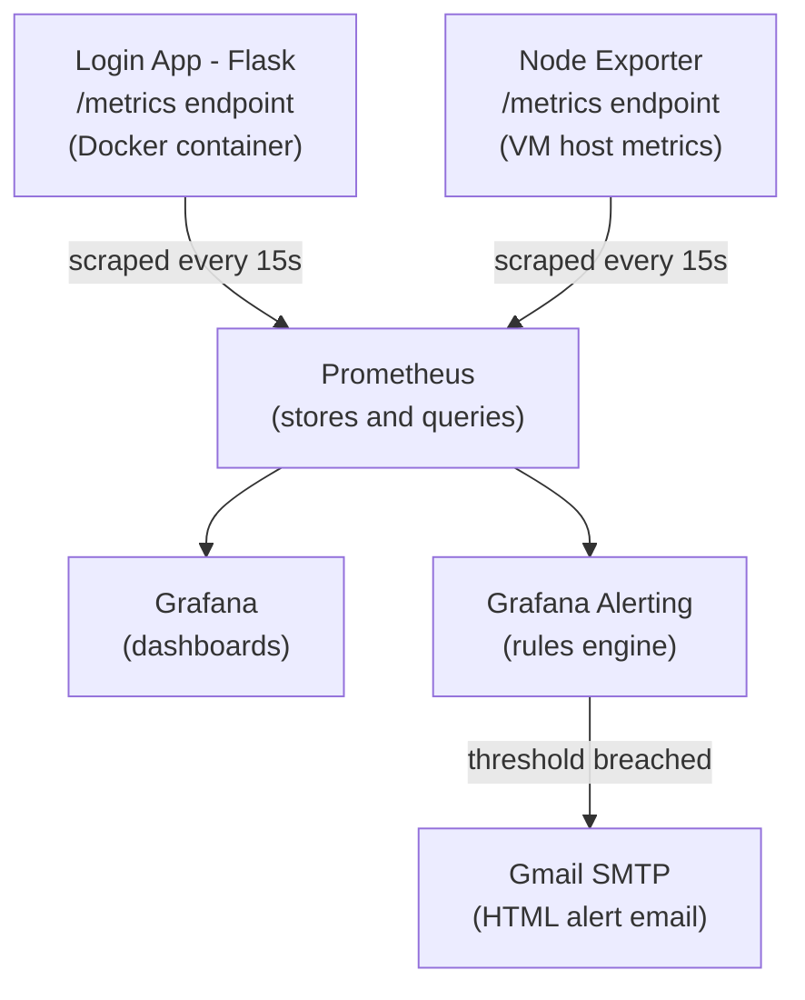

# VM Monitoring & Alerting Stack — Prometheus, Node Exporter & Grafana

A hands-on, self-hosted observability stack built from scratch on a Linux VM to learn and demonstrate how modern monitoring and alerting pipelines work end-to-end — from raw metrics exposure, to scraping, to visualization, to real-time email alerting.

---

## 🎯 Goal

The objective of this project was to understand **how observability tooling actually works under the hood**:

- Stand up Prometheus, Node Exporter, and Grafana as **standalone systemd services** on a plain Linux VM.
- Build a **custom instrumented application** (a login service) to see what it means to expose application-level metrics, not just system metrics.
- Learn the full **scrape → store → query → visualize** pipeline.
- Configure **alerting rules** on both application behavior (failed logins) and system health (CPU usage).
- Wire up **email notifications**
---

## ✅ What Was Achieved

By the end of this project, the VM runs a fully working, self-contained monitoring stack:

| Component | Role | Status |
|---|---|---|
| **Prometheus** | Scrapes and stores time-series metrics | ✅ Running as systemd service |
| **Node Exporter** | Exposes VM-level system metrics (CPU, memory, disk, network) | ✅ Running as systemd service |
| **Custom Login App** | Flask app instrumented with `prometheus_client`, exposing app-level metrics | ✅ Containerized with Docker |
| **Grafana** | Dashboards for both system and application metrics | ✅ Running as systemd service, connected to Prometheus |
| **Grafana Alerting** | Threshold-based alert rule on CPU usage | ✅ Configured, tested, firing correctly |
| **Email Notifications** | HTML-formatted alert emails via Gmail SMTP | ✅ Working, includes reason, instance, and remediation steps |

---

## 🏗️ Architecture



All components run as **native systemd services** directly on the VM (no Kubernetes, no Docker for the monitoring stack itself — only the demo login app is containerized).

---

## 🧩 Components in Detail

### 1. Prometheus
- Installed manually from the official GitHub release binary (not the outdated distro package) to get the latest version.
- Configured via `/etc/prometheus/prometheus.yml` with scrape jobs for itself, Node Exporter, and the login app.

  


### 2. Node Exporter
- Exposes host-level metrics by reading directly from the Linux kernel's `/proc` and `/sys` virtual filesystems (e.g. `/proc/stat` for CPU, `/proc/meminfo` for memory, `/proc/diskstats` for disk I/O).
- Runs a wide set of **collectors** enabled by default (`cpu`, `meminfo`, `diskstats`, `filesystem`, `netdev`, `loadavg`, and more) — each collector maps to a specific kernel data source.
- No values are invented — Node Exporter is purely a translator from raw kernel counters into Prometheus's metric format.

  

### 3. Custom Login App
A minimal Flask application built specifically to generate realistic, non-trivial application metrics — moving beyond system-level monitoring into **application observability**.

**Metrics exposed:**
- `login_attempts_total` — counter, total login attempts
- `login_success_total` — counter, successful logins
- `login_failure_total{reason}` — counter, labeled by failure reason (`bad_password`, `unknown_user`, `missing_fields`)
- `login_request_duration_seconds` — histogram, request latency
- `active_sessions` — gauge, currently logged-in sessions

 


Runs in Docker for isolation and portability, with routes supporting both a browser-based HTML login form and JSON API requests (curl/testing).

### 4. Grafana
- Connected to Prometheus as a data source (`http://localhost:9090`).
- Dashboards built for:
  - Login app metrics (attempt rate, failure breakdown by reason, active sessions, p95 latency)
  - Full system metrics via the community **Node Exporter Full** dashboard (Grafana.com ID `1860`) — covering CPU, memory, disk, and network without manually building each panel.


### 5. Alerting
- Alert rule (`cpuCheck`) defined directly in Grafana's native alerting engine, querying Prometheus:
  ```promql
  100 - (avg by (instance) (rate(node_cpu_seconds_total{mode="idle"}[1m])) * 100)
  ```
  Condition: fires when CPU usage exceeds a configurable threshold (set low, at 20%, for easy observation/testing).
- **Contact point** configured for email delivery via Gmail SMTP (using an App Password, since Gmail blocks standard password auth for SMTP).
- **Custom HTML notification template** built so alert emails are informative and actionable rather than a bare threshold notice. Each email includes:

 

---

## 🔍 How It Was Achieved — Step-by-Step Summary

1. **Installed Prometheus and Node Exporter** from official binaries, set up as systemd services with dedicated non-login system users for security.
2. **Installed Grafana** via its official APT repository, run as its own systemd service.
3. **Built and containerized a login app** in Flask, instrumented with `prometheus_client`, and added it as a Prometheus scrape target.
5. **Connected Grafana to Prometheus** as a data source and validated the connection.
6. **Built dashboards** for both the custom login app and full VM system metrics.
7. **Created and tested a CPU alert rule** in Grafana, using a deliberately low threshold to safely observe the full alert lifecycle: `Normal → Pending → Firing → Resolved`.
8. **Configured Gmail SMTP** with an App Password and built a custom HTML email template so alerts are professional and immediately actionable.
9. **Load-tested the alert** using `yes > /dev/null &` to simulate CPU saturation, confirming the alert fires and the email arrives correctly, then explored how such load could occur unintentionally (e.g. a rogue process or cron job) and how to guard against it using `cgroups`/`systemd` CPU quotas, `ulimit`, and restricting cron access.

---

## 🚀 Running It Yourself

```bash
# 1. Prometheus & Node Exporter — see /docs/install-prometheus.md
# 2. Grafana — see /docs/install-grafana.md
# 3. Login demo app
cd login-app
docker build -t prom-login-app .
docker run -d --name prom-login-app -p 5000:5000 prom-login-app

# 4. Add scrape targets in /etc/prometheus/prometheus.yml, then:
sudo systemctl restart prometheus
```

Full step-by-step setup instructions are in [`/docs`](./docs).

---


## 🛠️ Tech Stack

`Prometheus` · `Node Exporter` · `Grafana` · `Flask` · `Docker` · `systemd` · `PromQL` · `Gmail SMTP`

---
